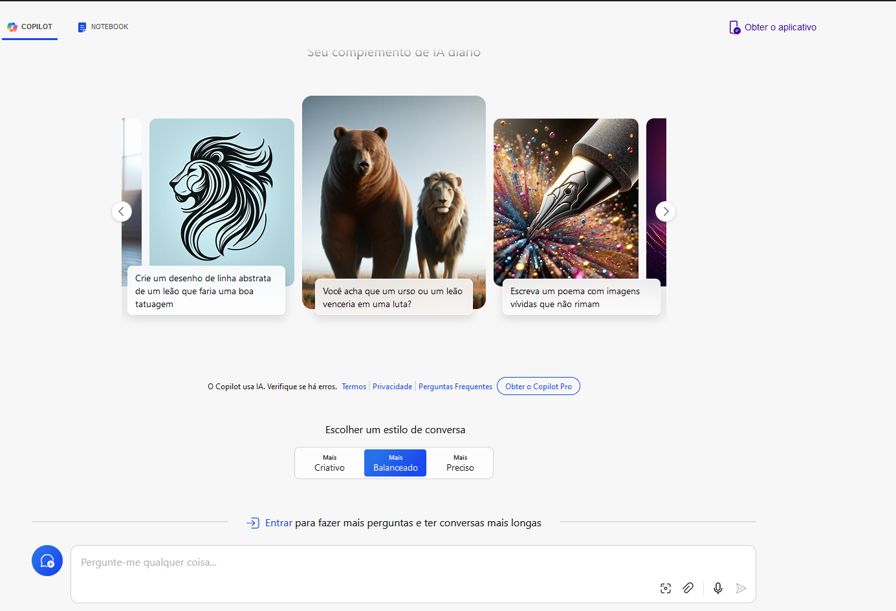
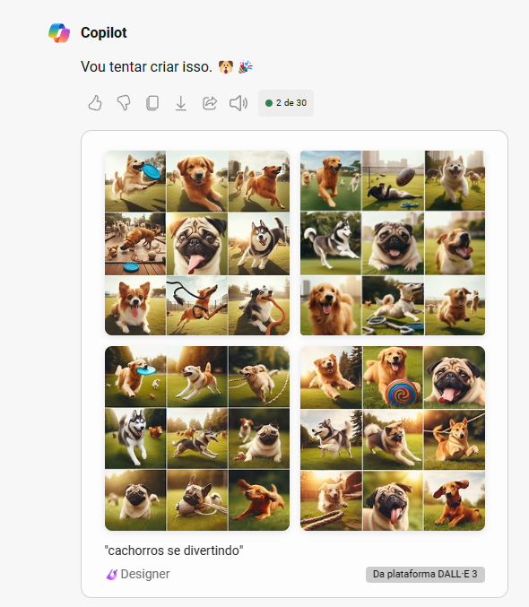

# Guia de utilização de IA generativa dentro do ambiente Azure

Caso seja sua primeira interação com o ambiente Azure, recomendo visitar primeiro [este repositório](https://github.com/HugoCSouza/inicio-azure), que indica os passos iniciais de configuração de um ambiente Azure.

## Microsoft Copilot

[Microsoft Copilot](https://copilot.microsoft.com/) é uma ferramenta de IA generativa que te ajuda nas suas pesquisas online fornecendo respostas mais dinâmicas e dotadas de referências, ao invés do velho método indexador.



Você pode alternar entre os modos: criativo, preciso e balanceado. Estes modos dizem respeito à liberdade da IA de gerar respostas mais elaboradas e menos intrinsecamente ligadas aos conteúdos de referência. Vamos utilizar nos exemplos aqui o modo balanceado, mas você pode usar o que for mais confortável para a sua aplicação.

Você pode utilizar diversas ferramentas dentro da interface web do Copilot e aqui vamos demonstrar alguns exemplos.

### Gerando respostas a partir de prompts

No campo "Pergunte-me qualquer coisa", vamos usar como primeiro exemplo a seguinte pergunta:

    Me diga vantagens e desvantagens de se utilizar corrida de aplicativo ao invés de comprar um carro.

Obtivemos a seguinte resposta do copilot:

```markdown
**Usar aplicativos de corrida** versus **comprar um carro** é uma escolha que envolve considerações importantes. Vamos explorar as vantagens e desvantagens de cada opção:
**Usar Aplicativos de Corrida:**
- **Facilidade de Uso**: Aplicativos como Uber, Cabify e 99 são **simples de usar**. Basta baixá-los, fazer o cadastro e solicitar um motorista.
- **Custo Direto**: Você paga apenas pela corrida, sem se preocupar com **manutenção do veículo, IPVA, seguros ou multas**.
- **Trânsito e Condução**: Não precisa se preocupar com o trânsito, pois outra pessoa dirige para você. Isso permite que você aproveite o tempo para outras atividades, como redes sociais, ligações ou verificação de e-mails.
- **Estacionamento**: Não precisa encontrar uma vaga para seu veículo.
**Desvantagem**:
- **Custo por Quilômetro**: O valor do quilômetro rodado em aplicativos de corrida tende a ser mais caro do que o de um carro comum.
**Comprar um Carro**:
- **Conforto e Praticidade**: Ter um carro próprio oferece mais **conforto e liberdade**. É ideal para viagens longas e para transportar crianças e idosos.
- **Custos Adicionais**: No entanto, há custos mais altos, como parcelas do financiamento, IPVA, licenciamento, seguro, manutenções periódicas e eventuais consertos.

**Conclusão**:
- Avalie suas necessidades pessoais e o uso que fará do veículo. Para quem roda muito, especialmente com bagagem e passageiros, o carro próprio pode ser a melhor escolha. Já para trajetos curtos e sem companhia, os aplicativos de transporte são mais econômicos
```

O bloco de resposta foi copiado conforme a formatação Markdown da resposta, mas ainda dando ênfase no que foi respondido. Há de se destacar que abaixo das respostas, as referências de onde o Copilot se baseou para entregar a resposta desejada estão no final do prompt, conforme a imagem abaixo.


Você pode fazer qualquer outro tipo de pesquisa usando prompt, sua imaginação é o limite, portanto, hora da sua vez de realizar e utilizar o Copilot como o seu buscador oficial. Vale lembrar que o copilot transforma as perguntas para a lingua na qual ele foi implementado, o inglês, o que pode ter alguns problemas de interpretação.

### Geração de imagens

Você também pode utilizar o Copilot, que através do Dall-E, irá gerar imagens baseado no prompt especificado.

Como exemplo, vamos testar o seguinte prompt.

    gere imagens de cachorros se divertindo

E como resposta obtivemos:



A sua imaginação é o limite para a geração de imagens do Dall-E.

### Geração de códigos

Desenvolvedores podem também se beneficiar das benfeitorias que são alcançadas via IA generativa. Podemos utilizar o Copilot para gerar pequenos blocos de código, agilizando a criação de funções básico ou escopos de classes.

Vamos utilizar como exemplo o seguinte prompt:

    Gere um código de uma calculadora com as 4 operações básicas em python, C# e Javascript.

Copiaremos apenas a respostas dos código em cada linguagem.

O código em python gerado foi:

``` python
def add(a, b):
    return a + b

def subtract(a, b):
    return a - b

def multiply(a, b):
    return a * b

def divide(a, b):
    if b != 0:
        return a / b
    else:
        return "Erro: Divisão por zero"

# Exemplo de uso
a = 10
b = 5
print(f"Adição: {add(a, b)}")
print(f"Subtração: {subtract(a, b)}")
print(f"Multiplicação: {multiply(a, b)}")
print(f"Divisão: {divide(a, b)}")
```

O código gerado em C# foi:

```c#
using System;

class Calculator
{
    static double Add(double a, double b)
    {
        return a + b;
    }

    static double Subtract(double a, double b)
    {
        return a - b;
    }

    static double Multiply(double a, double b)
    {
        return a * b;
    }

    static double Divide(double a, double b)
    {
        if (b != 0)
        {
            return a / b;
        }
        else
        {
            throw new DivideByZeroException("Erro: Divisão por zero");
        }
    }

    static void Main()
    {
        double a = 10;
        double b = 5;
        Console.WriteLine($"Adição: {Add(a, b)}");
        Console.WriteLine($"Subtração: {Subtract(a, b)}");
        Console.WriteLine($"Multiplicação: {Multiply(a, b)}");
        Console.WriteLine($"Divisão: {Divide(a, b)}");
    }
}
```

E por fim, o código em JavaScript:

```javascript
function add(a, b) {
    return a + b;
}

function subtract(a, b) {
    return a - b;
}

function multiply(a, b) {
    return a * b;
}

function divide(a, b) {
    if (b !== 0) {
        return a / b;
    } else {
        return "Erro: Divisão por zero";
    }
}

// Exemplo de uso
const a = 10;
const b = 5;
console.log(`Adição: ${add(a, b)}`);
console.log(`Subtração: ${subtract(a, b)}`);
console.log(`Multiplicação: ${multiply(a, b)}`);
console.log(`Divisão: ${divide(a, b)}`);
```

Assim como nos outros exemplos, as referências se encontram no final do prompt.
